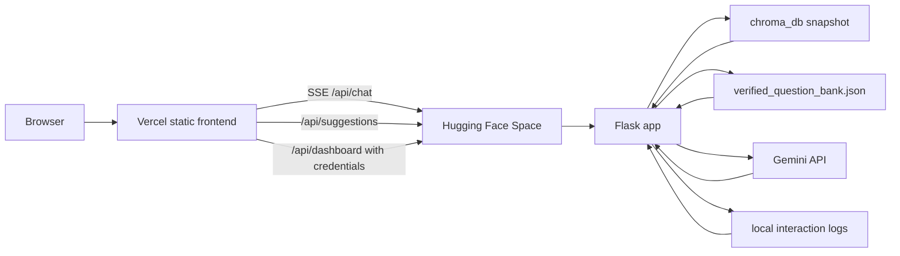

# Deployment

Setup reference for the SSL Research Assistant: environment variables, the
Supabase schema, and the Hugging Face + Vercel split. See the
[README](README.md) for what the system is and how it works.

### Local Development

1. **Install dependencies**
   ```bash
   pip install -r requirements.txt
   ```
2. **Set your Gemini API key**
   ```bash
   export GEMINI_API_KEY=your_key_here
   ```
3. **Run the server**
   ```bash
   python3 Chatbot.py
   ```
4. Open `http://localhost:7860` for the chat UI.
5. Open `http://localhost:7860/dashboard` for the analytics dashboard.

The default port is `7860` (Hugging Face Spaces convention). Override with `PORT` or `CHATBOT_PORT` if needed. Set `CHATBOT_HOST=127.0.0.1` to bind to localhost only.

### Admin Dashboard Authentication

The staff dashboard requires an authenticated admin session. Configure these
deployment secrets; authentication fails closed when any are missing:

```bash
export ADMIN_USERNAME=admin
export ADMIN_PASSWORD_HASH='your-werkzeug-password-hash'
export DASHBOARD_SESSION_SECRET='long-random-session-secret'
export CORS_ORIGINS='https://your-frontend.example'
export SESSION_COOKIE_SECURE=1
export SESSION_COOKIE_SAMESITE=None
```

Generate a password hash without storing the plaintext password in the app:

```bash
python3 -c "from werkzeug.security import generate_password_hash; print(generate_password_hash(input('Password: ')))"
```

Set `SESSION_COOKIE_SECURE=0` only for local HTTP development. Never expose dashboard routes without configuring the admin credentials and session secret.

Bare hostnames such as `your-frontend.example` are also accepted and normalized to `https://your-frontend.example`; wildcards and paths are rejected.

`CORS_ORIGINS` must match the browser's `Origin` exactly. A trailing slash is
normalized away, because a browser never sends one and the mismatch produced no
`Access-Control-Allow-Credentials`, which silently dropped the session cookie.
`/api/health` reports whether credentialed CORS initialised, so a
misconfiguration is visible rather than looking like a login bug.

#### Creating staff accounts

Two routes, checked in this order:

1. **Supabase Auth** — add the user under Authentication → Users, then mark them
   staff. A valid login is not sufficient; the account needs
   `app_metadata.role = "staff"`, which is writable only with the service role
   key, so a visitor cannot promote themselves:

   ```sql
   update auth.users
   set raw_app_meta_data = coalesce(raw_app_meta_data, '{}'::jsonb) || '{"role":"staff"}'::jsonb
   where email = 'employee@example.edu';
   ```

   Staff can be added or removed from the Supabase dashboard with no redeploy.

2. **`ADMIN_USERS_JSON`** — one account per person, no Supabase required:

   ```bash
   python3 make_admin_users.py alice bob carol      # prompts for each password
   pbpaste | python3 make_admin_users.py --merge dave   # add someone later
   ```

   Paste the output into the Space as a **Secret** named `ADMIN_USERS_JSON`.
   Only pbkdf2 hashes are stored. Changes need a Space restart.

### Split Deployment: Hugging Face (backend) + Vercel (frontend)

To avoid the Hugging Face Spaces iframe chrome, the backend and frontend deploy separately:



Vercel serves only static HTML/CSS/JS. Hugging Face runs the Dockerized Flask backend, the prebuilt vector store, the verified suggestion bank, admin sessions, and Gemini calls.

#### Backend on Hugging Face Spaces (Docker SDK)

The repo is already wired up for this:
- [`Dockerfile`](Dockerfile) — installs deps, pre-downloads the embedding model, exposes port `7860`, runs `python Chatbot.py`.
- [`.dockerignore`](.dockerignore) — excludes dev/benchmark artifacts from the image.
- [`.hf/space-header.md`](.hf/space-header.md) holds the README frontmatter the Space needs (`sdk: docker`, `app_port: 7860`). It is kept out of the GitHub README, which renders frontmatter as a stray table.
- [`Chatbot.py`](Chatbot.py) wires up `flask-cors` and reads `CORS_ORIGINS` from env.
- [`verified_question_bank.json`](verified_question_bank.json) is copied into the image so production suggestion chips use the same curated bank as local tests.

Steps:

1. Create a new Hugging Face Space and pick **Docker** as the SDK.
2. Push to the Space with [`./deploy_hf.sh`](deploy_hf.sh) — never `git push hf main` directly.

   ```bash
   ./deploy_hf.sh
   ```

   It rebuilds the `hf-deploy` branch from `main`, prepends the Space header to
   the README, drops `Eval_ordered/` and `question_eval_set/` so the run
   artifacts stay on GitHub and out of the image, and pushes to the Space.
   `hf-deploy` is derived, so do not edit it by hand — the next run overwrites
   it. `HF_DEPLOY_DRY_RUN=1 ./deploy_hf.sh` builds the branch without pushing.
3. In **Space Settings → Variables and secrets**, set:
   - `GEMINI_API_KEY` — your Gemini key (secret).
   - `CORS_ORIGINS` — comma-separated list of allowed origins, e.g. `https://your-app.vercel.app,http://localhost:5173`. Cross-origin API access is disabled if unset.
   - `TRUST_PROXY_HEADERS` — set to `1` only when the deployment has a trusted reverse proxy that supplies client IP headers; otherwise rate limiting uses the direct peer address.
   - `DASHBOARD_TRACE_MODE` — defaults to `staff`, which exposes question/answer previews plus full pipeline traces for troubleshooting. Set to `public` if the dashboard API is exposed outside staff-only access and should redact prompts/planning fields.
   - `SUGGESTIONS_VERIFY_RETRIEVAL` — optional. Defaults to `0` for fast verified-bank suggestions. Set to `1` if you want suggestions to rerun retrieval over each candidate at runtime.
   - Optionally `GEMINI_MODEL` to override the default model.
   - Optionally `REWRITE_MODEL` to override the fast rewrite/classification model; the default is `gemma-4-26b-a4b-it`.
   - `SUPABASE_URL`, `SUPABASE_ANON_KEY`, `SUPABASE_SERVICE_ROLE_KEY` — enable durable dashboard storage and per-employee sign-in. See "Staff dashboard storage" below. Leave unset to fall back to the local JSONL log.
   - Optionally `FLAG_MIN_TOP_SCORE` (default `0.90`) and `FLAG_MIN_SCORE_GAP` (default `0`, disabled) to tune which answers are kept for review.
   - Optionally `ADMIN_USERS_JSON` for env-configured dashboard accounts when Supabase Auth is not used.
   - Optionally `LLM_PRICE_TABLE_JSON` to price token usage on the dashboard, e.g. `{"gemini-3.5-flash-lite": {"input": 0.10, "output": 0.40, "cached": 0.025}}`. Values are USD per 1M tokens; `cached` defaults to a quarter of the input rate. Models with no entry show token counts with an `unpriced` cost.
4. Wait for the Space to build. The endpoint is `https://<user>-<space>.hf.space`.
5. On free Spaces the filesystem is ephemeral. This deployment commits a prebuilt `chroma_db/` snapshot and loads it at runtime; it intentionally does not rebuild from `SEED_DOCUMENTS/`. If the snapshot is missing or empty, the API reports a startup error instead of spending the launch window indexing documents.

### Staff dashboard storage

The Space filesystem is ephemeral, so `logs/chat_events.jsonl` is wiped on every
restart. Point the dashboard at Supabase to keep its history, and to let several
employees sign in with their own accounts.

**What gets stored.** Content and metrics are deliberately separate:

| Table | Contents | Written for |
| --- | --- | --- |
| `chat_metrics` | numbers only — latency, path, tokens, cost, confidence, retrieval scores. **No question or answer text.** | every answer |
| `flagged_chats` | the full transcript, sources, and trace | flagged answers only |
| `admin_audit_events` | who signed in, and which interaction they opened | each dashboard action |
| `daily_metrics` | a view: per-day counts, avg/p95 latency, tokens, cost, avg confidence and retrieval score | derived |

An ordinary visitor chat therefore leaves no transcript behind, while the
dashboard's headline numbers still describe all traffic rather than only the
failures.

**An answer is flagged when** it was blocked, errored, needed clarification, came
back low confidence, retrieved nothing above `FLAG_MIN_TOP_SCORE`, or answered
with no sources. Tune the thresholds with `FLAG_MIN_TOP_SCORE` and
`FLAG_MIN_SCORE_GAP`.

**Setup**

1. Create a Supabase project (the free tier is enough).
2. In **SQL Editor**, run [`supabase/schema.sql`](supabase/schema.sql).
3. In **Authentication → Providers → Email**, decide on signups:
   * Leave **Enable sign ups** ON if visitors may create accounts to save their
     own chat history. Staff access does not depend on this being off: a
     self-registered visitor has no staff role, so they cannot reach the
     dashboard.
   * Turn it OFF if only staff will ever have accounts.
4. In **Authentication → Users**, invite each employee by email. They set their
   own password from the invite link. Then open each user and set their
   **App Metadata** to:

   ```json
   { "role": "staff" }
   ```

   Only accounts carrying this role can sign in to the dashboard. App metadata
   is writable only with the service role key, so a user cannot grant it to
   themselves, and a visitor account in the same project can never reach staff
   data. Adding or removing staff needs no restart and no redeploy.

   Older Supabase dashboards do not expose app metadata for editing. Use the
   helper instead, which does the same thing from the command line:

   ```bash
   python3 make_staff.py someone@umb.edu           # grant dashboard access
   python3 make_staff.py someone@umb.edu --remove  # revoke it
   python3 make_staff.py --list                    # who has access
   ```
5. In **Project Settings → API**, copy the project URL, the `anon` key, and the
   `service_role` key.
6. Add all three to the Space as **Secrets** (not Variables):
   `SUPABASE_URL`, `SUPABASE_ANON_KEY`, `SUPABASE_SERVICE_ROLE_KEY`.
   `DASHBOARD_SESSION_SECRET` must also be set for sessions to work.

Verify the whole setup with:

```bash
python3 verify_supabase.py
```

It checks the environment, confirms each table is reachable, writes and reads
back a test row, exercises the daily rollup, and cleans up after itself.

The `service_role` key bypasses row-level security, so it belongs only in the
Space secrets — never in the frontend or the repo. Both tables have RLS enabled
with no permissive policy, so a leaked `anon` key cannot read transcripts.

**Without Supabase**, set `ADMIN_USERS_JSON` to a JSON object of username to
password hash and generate it with:

```bash
python3 make_admin_users.py alice bob carol
```

Each employee still gets their own login, but changing the roster means editing
the secret and restarting the Space.

### Visitor accounts and chat history

Signing in is optional and only affects whether a visitor's own history is
saved. Nothing about the chatbot's answers changes.

* **Anonymous visitors are stored nowhere.** No account means no conversation
  and no message rows, exactly as before. Their answers still contribute the
  content-free numbers in `chat_metrics`.
* **A signed-in visitor gets their own history**, in `visitor_conversations`
  and `visitor_messages`, and can delete it at any time.
* **The sidebar lists sessions, not questions.** One row per session, titled
  with the message that opened it. Clicking a row reopens that session and
  adopts its id, so the next message continues the thread rather than starting
  a new one. **+ New** begins a fresh session; deleting asks first.
* **A session holds at most `VISITOR_MESSAGE_CAP` (200) saved messages**, user
  and assistant rows counted together. On reaching it the answer still streams
  back and only saving stops: the server emits `session_full` and the UI asks
  the visitor to start a new session. Chosen over silently dropping the oldest
  turns to make room, or letting one session grow without bound.
* **Visitors can only ever see their own.** These tables are read and written
  with the visitor's own access token, never the service role key, and their
  policies are `auth.uid() = user_id`. Postgres does the enforcing, so a bug in
  the backend cannot expose one visitor's history to another.
* **Staff see flagged answers from everyone, and no visitor identity.**
  `flagged_chats` carries the question and the retrieval trace but no user id or
  email, so quality review cannot become a way to read one named person's chat
  history. The staff dashboard never queries the visitor tables; the personal
  dashboard reads them only with the caller's own token.

Visitor endpoints: `POST /api/visitor/signup`, `POST /api/visitor/login`,
`POST /api/visitor/logout`, `GET /api/visitor/session`,
`GET /api/visitor/conversations`, `GET /api/visitor/conversations/<id>`,
`DELETE /api/visitor/conversations/<id>`.

#### Frontend on Vercel (static site)

The [`frontend/`](frontend/) directory is a ready-to-deploy static site.

1. Edit [`frontend/index.html`](frontend/index.html) and replace the `window.API_BASE` placeholder with your HF Space URL:
   ```html
   <script>
     window.API_BASE = "https://<user>-<space>.hf.space";
   </script>
   ```
2. Deploy:
   ```bash
   cd frontend
   npx vercel            # preview
   npx vercel --prod     # production
   ```
   Or import the `frontend/` folder in the Vercel dashboard — no build step needed, it's pure static.
3. After the first Vercel deploy, copy the production URL and add it to `CORS_ORIGINS` on your Hugging Face Space.
4. Open the Vercel URL — clean UI, no Hugging Face border.

#### Things to Watch

- **Cold starts** — free HF Spaces sleep after inactivity. First request after sleep still loads ChromaDB and the embedding model, but does not index documents. The Dockerfile pre-downloads the model to remove the model-download delay.
- **CORS** — `flask-cors` is wired to `/api/*` only. SSE works cross-origin as long as your Vercel domain is in `CORS_ORIGINS`.
- **Suggestions** — production suggestions require `verified_question_bank.json` inside the Docker image. If `/api/suggestions` returns empty for otherwise relevant answered questions, confirm the Dockerfile copies that file and the Space has rebuilt.
- **Dashboard persistence** — interaction logs live on disk. On ephemeral filesystems they reset on every restart. The dashboard UI now lives in the static frontend, while its data still comes from the backend's `/api/dashboard` endpoints.
- **`GEMINI_API_KEY`** — never commit it. Use Space secrets only.
