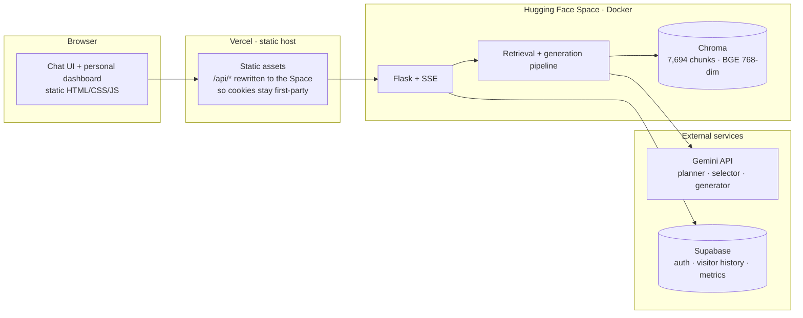
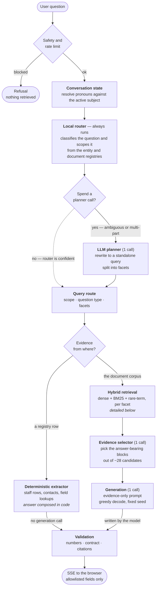
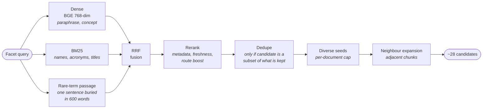

# Sustainable Labs ChatBot

A RAG (Retrieval-Augmented Generation) chatbot for the UMass Boston Sustainable Solutions Lab. Built by Team 1 "RAG's to Riches".

## 1. Why We Built This

The Sustainable Solutions Lab has information spread across project pages, staff profiles, annual reports, publications, and research summaries. A normal keyword search can find documents, but it does not reliably understand follow-up questions, pronouns, multiple facts in one question, or which source is authoritative.

We built this assistant to provide a conversational research interface that:

- Answers questions about SSL using the lab's own corpus rather than general model knowledge.
- Makes source-backed research, people, projects, and publications easier to explore.
- Remembers enough recent conversation to resolve follow-ups such as “what did she study?”
- Handles multi-part questions by separating their facets and preserving evidence for each facet.
- Shows citations and diagnostic information so an answer can be reviewed instead of trusted blindly.

The design deliberately combines deterministic software with an LLM. Deterministic routing, source metadata, validation, and citation handling provide control and repeatability; the LLM handles language understanding, query rewriting, planning, and final composition where flexible language reasoning is useful.

## 2. Architecture

Three deployed pieces, split so the chat UI is never inside a Hugging Face iframe
and the vector store ships with the backend image:



## 3. How It Works

Every branch below exists because a specific class of question failed without it.



**Inside hybrid retrieval.** Three retrievers cover each other's blind spots,
then the candidate set is narrowed without letting one document dominate.



**The validation gauntlet.** Every draft passes five checks before it ships.
Each one exists because a specific wrong answer got through without it.

| # | Check | The failure it caught |
| --- | --- | --- |
| 1 | Numbers appear in the evidence | The model reported "88%, 87%, 86%" for a corpus that says "8 in 10". Percentages are checked *as percentages* — a bare `27` on a page number used to satisfy a `27%` claim |
| 2 | Answer contract | A two-part question answered in one part. "Who is X **and** what did she say?" returned only the identity |
| 3 | Drop false negatives | "The documents do not state this" while the evidence plainly stated it |
| 4 | Chunk-boundary repair | A quotation split from its attribution across two chunks, so the model declined to attribute it |
| 5 | Citations match shown sources | Markers pointing at evidence the user was never shown |

### What each step does, and why it is there

| Step | What it does | Why |
| --- | --- | --- |
| Safety + rate limit | Screens the question before anything is retrieved | Blocks abuse without spending retrieval or tokens on it |
| Conversation state | Resolves pronouns and follow-ups against the active subject | "What did she study?" would otherwise retrieve on the pronoun |
| Local router | Always runs. Classifies the question and scopes it from the entity and document registries | Produces a usable route without any model call |
| Planner gate | Decides whether that route is confident enough to use as-is | An easy question should not pay for a planning call |
| LLM planner | Only when the gate says no: rewrites into a standalone query and splits multi-part questions into facets | Ambiguous and multi-part questions need the rewrite; a registry miss is never a final answer |
| Deterministic extractor | Pulls field-style facts — names, titles, emails, counts — straight from evidence | These are already structured; generating them adds cost and risk |
| Dense + BM25 + rare-term | Three retrievers per facet | Each covers the others' blind spot: paraphrases, exact names, and single sentences diluted across 600 words |
| RRF fusion + rerank | Merges the three lists, then boosts on source, section and freshness | Fuses without needing a trained reranker |
| Dedupe + diverse seeds | Drops a chunk only when it adds nothing over one already kept, and caps any one document's share | Stops a 358-chunk document owning the whole context window |
| Neighbour expansion | Adds adjacent chunks from the same document unit | Facts span chunk boundaries |
| Evidence selector | Picks the answer-bearing blocks from ~28 candidates | 86% of measured failures had the right document in context and used a topically similar block instead |
| Chunk-boundary repair | Prepends a cut lead-in, finishes a cut sentence | A quotation split from its attribution reads as "the documents do not state this" |
| Grounded generation | Composes from the selected evidence only, greedy with a fixed seed | Same question and evidence gives the same answer, so a change can be told from noise |
| Validation | The five checks above | Retrieval finding the right text does not mean the answer used it correctly |
| Suggestions | Follow-up chips drawn from `verified_question_bank.json` | Curated and answerable, rather than invented live |

## 4. Features

The chatbot answers questions about SSL research projects, publications, staff, initiatives, funding, and community partnerships using only the lab's own source documents. Everything the model says is grounded in retrieved chunks — no free-form invention.

### User-Facing Features

- **Grounded answers** drawn directly from SSL source documents (annual reports, project pages, publications, staff bios).
- **Streaming responses** — text appears token by token as Gemini generates it, using Server-Sent Events.
- **Suggested questions** — starter buttons on first load plus verified follow-up chips after some answers.
- **Saved sessions sidebar** — one row per session, titled with the message that opened it. Clicking a row reopens that session and continues it; **+ New** starts a fresh one, and deleting asks first. Signed-in visitors keep their sessions across logins, capped at 200 saved messages each.
- **Content filter** — blocks profanity, hate speech, threats, and SSL/UMB-targeted harassment with a custom whitelist for legitimate academic terms (e.g. `assessment`, `massachusetts`, bird species) and a custom block list for org-specific phrases.
- **Friendly error handling** — Gemini 503/429 errors surface as "high demand, try again" instead of raw stack traces.
- **Citation-aware answers** — citations are normalized against the final answer and filtered to sources actually shown to the user.
- **Personal analytics dashboard** at `/dashboard`, open without a login and scoped to the caller's own activity: latency, tokens, cost, retrieval path, cited sources, corpus coverage, and low-confidence cases. Anonymous visitors see the current session only; signed-in visitors also see their saved chats. The aggregate staff view over every visitor's chats stays behind an admin session.
- **Optional visitor accounts** — signing in only controls whether a visitor's own history is saved; answers are identical either way.

### Document Ingestion

At first run, [`SEED_DOCUMENTS/`](SEED_DOCUMENTS/) is parsed into structured units:
- Project pages get split per project ([`split_project_sections`](Chatbot.py#L455)).
- Staff/board/affiliate pages get split per person with name detection ([`split_people_sections`](Chatbot.py#L590)).
- Slide decks get split per slide ([`split_slide_sections`](Chatbot.py#L547)).
- Everything else is chunked with `RecursiveCharacterTextSplitter`.

Each chunk is embedded and stored in ChromaDB with rich metadata (title, category, folder, source path, section name, chunk level). The metadata is what makes routing and reranking possible.

---

## 5. Models and Cost per Answer

Three model calls per answer in production. The work is deliberately split
across two tiers so the expensive model only does what needs it.

| Stage | Model | Why this tier |
| --- | --- | --- |
| Query planner | `gemini-3.5-flash-lite` | Rewrites a contextual question into a standalone query and splits facets. Skipped entirely when the local router is already confident |
| Evidence selector | `gemini-3.1-flash-lite` | Picks the answer-bearing blocks from ~28 candidates. A cheaper tier is enough — it chooses between texts, it does not write |
| Generation | `gemini-3.5-flash-lite` | Composes the grounded answer, greedy decode with a fixed seed |
| Judge *(offline only)* | `gemini-3.1-flash-lite` | Scores benchmark runs. Never called in production |

Published paid-tier rates, USD per 1M tokens
([pricing](https://ai.google.dev/gemini-api/docs/pricing), checked 2026-09-05).
Thinking tokens bill at the output rate:

| Model | Input | Output | Cached input |
| --- | --- | --- | --- |
| `gemini-3.5-flash-lite` | $0.30 | $2.50 | $0.03 |
| `gemini-3.1-flash-lite` | $0.25 | $1.50 | $0.025 |
| `gemini-3.5-flash` | $1.50 | $9.00 | $0.15 |
| `gemini-3.1-flash` | $0.75 | $3.75 | $0.075 |
| `gemini-3.1-pro` | $2.00 | $12.00 | $0.20 |

A typical answer runs roughly 9k input and 750 output tokens across the three
calls, which lands around **$0.004 per answer** — about 250 questions per
dollar. The dashboard reports the real figure per answer rather than an
estimate, computed from the token counts the API returns.

## 6. Security Model

| Concern | How it is handled |
| --- | --- |
| Prompt injection and abuse | Input screened before retrieval; profanity, threats and SSL-targeted harassment blocked, with a whitelist so legitimate academic terms (`assessment`, `massachusetts`, bird species) are not caught |
| Rate limiting | Per-IP limits on chat, login and signup |
| What the browser may receive | An **allowlist**, not a blocklist. Prompts, evidence text, retrieval traces, chunk scores and routing decisions never leave the server, so a new internal field cannot leak by being forgotten |
| One visitor reading another's history | Visitor tables are read and written with the visitor's own access token, never the service-role key, under `auth.uid() = user_id` policies. Postgres enforces it, so a backend bug cannot cross the boundary |
| Staff reading named visitors' chats | `flagged_chats` carries the question and retrieval trace but no user id or email, so quality review cannot become surveillance |
| Session cookies | `HttpOnly`, `Secure`, `SameSite=None`, signed with a server-side secret. `/api` is proxied through the frontend origin so the cookie is first-party rather than a third-party cookie browsers now block |
| Staff privilege escalation | Dashboard access requires `app_metadata.role = "staff"`, writable only with the service-role key. A visitor cannot promote themselves |
| Secrets | Read from the environment only. No key, hash or token is committed; `.env` is ignored and `ADMIN_USERS_JSON` stores pbkdf2 hashes, never plaintext |

### A deliberate exception for this demo

**The employee dashboard access control is fully implemented — and switched off
for the public demo on purpose.**

The staff dashboard aggregates every visitor's chats, and that aggregate view is
still gated: `/api/dashboard`, `/api/dashboard/interaction/<id>` and their pages
all require an admin session, exactly as built. `make_admin_users.py`, the
Supabase staff role, and the fail-closed auth path are all in place and
documented above.

What the demo does instead is expose a **separate personal dashboard** that
carries the same operational depth — latency, tokens, cost, retrieval path,
cited sources, corpus coverage, low-confidence cases — but
scoped to whoever is looking. That way a reviewer can see how the observability
works without being handed admin credentials, and without anyone's
conversations being published.

Turning the staff view back on for a real deployment is configuration, not code:
set `DASHBOARD_SESSION_SECRET` plus either `ADMIN_USERS_JSON` or a Supabase
staff role, and sign in at `/admin/login`.

## 7. Tech Stack

**Backend** — Python 3 · Flask (REST + SSE) · Google Gemini (`google-genai`) ·
ChromaDB · sentence-transformers (`BAAI/bge-base-en-v1.5`) · custom BM25 ·
langchain-text-splitters · pypdf · better-profanity · python-dotenv

**Frontend** — HTML / CSS / vanilla JS, no framework · Server-Sent Events ·
`fetch` + `ReadableStream` · client-side Markdown rendering

**Auth and data** — Supabase Auth and Postgres, row-level security

**Hosting** — Hugging Face Spaces (Docker) · Vercel (static frontend, `/api` proxy)

---

## 8. Evaluation

Tuning ran against targeted failure subsets, not aggregate scores, with
chunk-level tracing on every run so we could see which chunks retrieval
returned and which stage lost the answer. Larger subsets and full runs then
showed where overall performance actually stood. Every failure we fixed turned
out to be a structural bug — evidence mangled before the prompt, a dedupe that
deleted the longer chunk, a validator misreading `2020-21` as an invented
number — not a tuning gap.

Two 208-question sets, scored by a separate Gemini judge pass on correctness
against the corpus, citations, hallucination, and whether every part of the
question was answered. The scores below count correctness failures; a further
13 answers on the newer set were correct but cited a different valid source
than the one the question expected.

| Set | Before | After |
| --- | --- | --- |
| `2026-07-11` — 160 single-turn + 48 multi-turn | 202/208 | **208/208** (48/48 multi-turn) |
| `2026-08-29` — 208 single-turn | 175 | **205/208** |

The three residual failures were checked by hand. Two are judge mistakes: one
where the judge swapped two rows of a bar chart, one where the answer is right
but drawn from a different valid document than the expected reference. The
third is a real miss — a dollar figure that only exists inside a chart image,
where the extracted text interleaves the values with axis labels and body prose.

Generation is greedy with a fixed seed, but the planner and evidence selector
are separate model calls that can fall back on a 503, so a single run moves by
about ±1 question. Compare full runs, not individual questions.

---

## 9. Running It

```bash
pip install -r requirements.txt
export GEMINI_API_KEY=your-key
python3 Chatbot.py            # http://localhost:7860
```

First run builds the vector store from `SEED_DOCUMENTS/`; after that it loads
the committed Chroma index.

Deployed as a Hugging Face Space (Docker, backend + vector store) with the
static frontend on Vercel, which proxies `/api` to the Space so session cookies
stay first-party. Environment variables, the Supabase schema, staff accounts
and the full deploy steps are in **[DEPLOYMENT.md](DEPLOYMENT.md)**.
