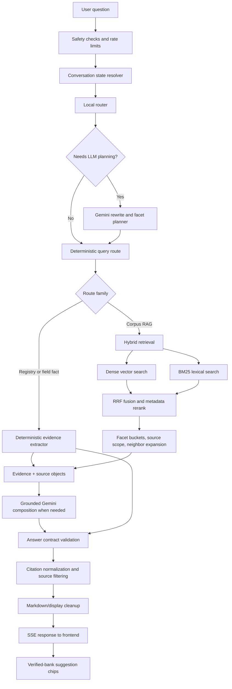
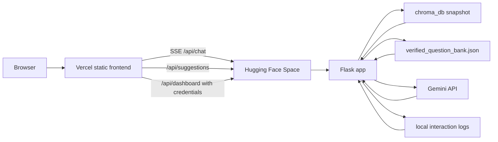

# Sustainable Labs ChatBot

A RAG (Retrieval-Augmented Generation) chatbot for the UMass Boston Sustainable Solutions Lab. Built by Team 1 "RAG's to Riches".

> The YAML frontmatter above is consumed by Hugging Face Spaces (Docker SDK). GitHub treats it as metadata and ignores it in rendering.

## Why We Built This Chatbot

The Sustainable Solutions Lab has information spread across project pages, staff profiles, annual reports, publications, and research summaries. A normal keyword search can find documents, but it does not reliably understand follow-up questions, pronouns, multiple facts in one question, or which source is authoritative.

We built this assistant to provide a conversational research interface that:

- Answers questions about SSL using the lab's own corpus rather than general model knowledge.
- Makes source-backed research, people, projects, and publications easier to explore.
- Remembers enough recent conversation to resolve follow-ups such as “what did she study?”
- Handles multi-part questions by separating their facets and preserving evidence for each facet.
- Shows citations and diagnostic information so an answer can be reviewed instead of trusted blindly.

The design deliberately combines deterministic software with an LLM. Deterministic routing, source metadata, validation, and citation handling provide control and repeatability; the LLM handles language understanding, query rewriting, planning, and final composition where flexible language reasoning is useful.

## End-to-End Pipeline



### Why the Pipeline Has These Stages

1. **Conversation state comes first.** The state machine records the active subject, source scope, candidate subjects, and recent turns. This allows a follow-up to refer to a person, project, book, event, or organization even when that subject is not in the entity registry.
2. **The rewrite is not the answer.** The LLM turns a contextual message into a standalone retrieval query and identifies the subject, intent, facets, and possible route. The original user question remains available for answer wording.
3. **The plan controls retrieval.** The router chooses registry lookup, document lookup, or corpus retrieval. A registry miss is not treated as a final answer; the system falls back to retrieval when the corpus may still contain the fact.
4. **Hybrid retrieval covers different failure modes.** Dense search handles paraphrases and concepts; BM25 handles exact names, titles, acronyms, and phrases. Metadata reranking then favors the correct source and section.
5. **Deterministic extraction handles fragile facts.** Repeated field-style facts such as names, titles, emails, affiliate expertise, program year, committee counts, or source-listed totals are extracted directly from evidence when possible. This avoids spending an LLM call on facts that are already present in a predictable structure.
6. **Evidence is scoped before generation.** The system keeps facet buckets separate, expands neighbors only within the same document unit, filters unrelated people or projects, and favors newer sources for current questions while preserving historical sources for dated questions.
7. **The answer is validated after generation.** Citations are restricted to returned evidence. The answer contract checks requested counts, retrieval-only locator details, missing facets, unsupported caveats, and raw retrieval-label leaks before the response reaches the UI.
8. **Suggestions are verified-bank based.** Follow-up chips are selected from `verified_question_bank.json` instead of being invented live. Runtime ranking is intentionally cheap so suggestions do not drag the answer stream.

This architecture prevents the common RAG failure where retrieval found the right text but the final model mixed evidence, answered an unasked clause, omitted a facet, or ignored a constraint.

### Core Techniques and Methods

| Technique | Where it is used | Why it matters |
|---|---|---|
| **Conversation-state resolution** | Follow-up handling before retrieval | Keeps pronouns and short follow-ups attached to the right person, project, source, or prior question. |
| **Local route classifier** | Fast first-pass routing | Avoids unnecessary planner calls for obvious questions and applies source scopes early. |
| **LLM query planning** | Ambiguous or multi-facet questions | Rewrites contextual questions into standalone retrieval queries and separates requested facts into facets. |
| **Hybrid retrieval** | Corpus search | Combines semantic vector retrieval with BM25 exact-match retrieval so paraphrases, names, acronyms, and titles are all recoverable. |
| **Reciprocal Rank Fusion** | Candidate merge | Fuses dense and sparse candidate lists without needing a trained reranker. |
| **Metadata-aware reranking** | Candidate ordering | Boosts candidates matching route title, category, folder, source path, section name, and exact query anchors. |
| **Facet-bucket retrieval** | Multi-part questions | Retrieves each requested sub-question separately so one easy fact does not crowd out another. |
| **Document-unit neighbor expansion** | Evidence repair | Adds adjacent chunks from the same source unit when a fact spans chunk boundaries. |
| **Entity and document registries** | People, projects, sections, field facts | Gives the system structured fallback paths when vector retrieval is too broad or too narrow. |
| **Deterministic evidence extractors** | Field facts, counts, roster details, contact info | Produces stable answers for source-stated facts without relying on generative wording. |
| **Answer contract validation** | Post-generation guardrail | Checks that the answer addresses the requested facets, counts, scope, and locator constraints. |
| **Citation normalization** | Final response packaging | Filters sources to cited evidence, renumbers citations, and prevents citations from pointing to unused or unrelated sources. |
| **Display cleanup** | Final streamed text | Removes backend retrieval labels, malformed punctuation, citation-only fragments, and leaked stream sentinels. |
| **Verified question bank suggestions** | Post-answer follow-up chips | Recommends only curated answerable questions and avoids slow live retrieval over every candidate by default. |
| **Admin-session dashboard** | Staff diagnostics | Protects traces and chat diagnostics behind login while preserving debug visibility for maintainers. |

---

## 1. What We Built & How It Works

The chatbot answers questions about SSL research projects, publications, staff, initiatives, funding, and community partnerships using only the lab's own source documents. Everything the model says is grounded in retrieved chunks — no free-form invention.

### User-Facing Features

- **Grounded answers** drawn directly from SSL source documents (annual reports, project pages, publications, staff bios).
- **Streaming responses** — text appears token by token as Gemini generates it, using Server-Sent Events.
- **Suggested questions** — starter buttons on first load plus verified follow-up chips after some answers.
- **Recent questions sidebar** — in-session navigation that scrolls the chat back to a previous question on click.
- **Content filter** — blocks profanity, hate speech, threats, and SSL/UMB-targeted harassment with a custom whitelist for legitimate academic terms (e.g. `assessment`, `massachusetts`, bird species) and a custom block list for org-specific phrases.
- **Friendly error handling** — Gemini 503/429 errors surface as "high demand, try again" instead of raw stack traces.
- **Citation-aware answers** — citations are normalized against the final answer and filtered to sources actually shown to the user.
- **Analytics dashboard** at `/dashboard` for reviewing chat history, source mappings, retrieval diagnostics, confidence scores, latency, and evaluation results.

### The Retrieval Pipeline

The interesting work happens *before* the LLM is called. A user question goes through these stages:

#### a) Intent Classification & Query Routing

When a question comes in, the chatbot first figures out **what kind of question it is** and **which slice of the corpus is most relevant**. This is done in layers:

1. **Keyword-based local router** ([`detect_local_query_route`](Chatbot.py#L1388)) — a fast, deterministic classifier that tags the question with:
   - A **question type**: `broad_overview`, `specific_fact`, `people_lookup`, `publication_inventory`, or `list_inventory`.
   - A **scope**: which document titles, categories, and folders to filter retrieval to (e.g. "staff" → `Staff`, `SSLAbout`; "board" → `BoardOfDirectors`; "publications" → `Publications`).
   - A **`prefer_summary` hint** that biases ranking toward short summary chunks vs. detail chunks.
2. **Heuristic LLM-planning gate** ([`should_use_llm_planning`](Chatbot.py#L104)) — decides whether the question is ambiguous enough to deserve a more expensive LLM-powered planning call. Skips the LLM when confidence is decent, the query is short, targets are already found, or the topic is obviously clear. Saves tokens and latency on easy questions.
3. **LLM query planner** ([`plan_query_with_llm`](Chatbot.py#L1722)) — only invoked when the gate says the heuristic wasn't enough. Given a catalog of titles, categories, folders, and entity names, Gemini picks the right routing scope itself.
4. **Facet extraction** — multi-part questions are split into focused sub-questions so retrieval can preserve evidence for each requested fact instead of letting one dominant chunk crowd out the rest.

#### b) Ensemble / Hybrid Search

Retrieval runs two search engines in parallel and fuses their results:

1. **Dense retrieval** ([`retrieve_dense_candidates`](Chatbot.py#L1093)) — semantic vector search over ChromaDB using `all-MiniLM-L6-v2` embeddings. Strong at paraphrase and conceptual matches.
2. **BM25 sparse retrieval** ([`retrieve_bm25_candidates`](Chatbot.py#L1135)) — lexical keyword search. Strong at exact terms, names, and acronyms that vector search sometimes misses.
3. **Reciprocal Rank Fusion** ([`fuse_candidates`](Chatbot.py#L1183)) — combines the two ranked lists with the RRF formula (`weight / (60 + rank)`). Weights are adaptive ([`get_hybrid_weights`](Chatbot.py#L1228)): summary-preferred queries favor dense, fact-lookup queries favor BM25, hard-routed queries weight both equally.
4. **Metadata-aware reranking** ([`rerank_candidates`](Chatbot.py#L1308)) — boosts candidates whose source path, title, category, or folder matches the route, plus exact-term hits in body or section name. The final ordering is what gets sent to the LLM.

#### c) Adaptive Candidate Pool

[`choose_candidate_pool`](Chatbot.py#L141) sizes the candidate pool based on the question type: broad overviews pull more candidates for coverage, specific-fact questions pull fewer to save retrieval work (roughly 15–20% reduction over a fixed multiplier).

#### d) Entity Resolution & Follow-ups

A separate entity registry is built at ingest time from staff, board, affiliate, and project sections. At query time the bot tries to:
- Match exact and phrased person/project names ([`find_phrase_matched_entities`](Chatbot.py#L2421)).
- Resolve pronouns and "what about her?" follow-ups against recent conversation turns ([`resolve_recent_entity_follow_up`](Chatbot.py#L2179)).
- Detect multi-group people-overview asks vs. specific-entity-detail asks so the response shape matches the question.

#### e) Deterministic Answer Paths

Not every answer needs a generative model. For predictable source-stated facts, the app can answer directly from retrieved or registry evidence:

- Roster fields such as title, department, institute, affiliate expertise, email, and phone.
- Count or total facts when a source directly states the number.
- Person/project relationship sentences that can be quoted or lightly normalized from one evidence block.
- Structured “not stated” fallbacks when retrieval genuinely does not contain the requested fact.

These paths are intentionally dynamic: they are based on source structure, field labels, requested facets, and retrieval evidence rather than hard-coded case IDs.

#### f) Generation and Post-Processing

Retrieved chunks are formatted into a prompt and sent to Gemini via a **singleton client** (created once at startup, reused across requests). `max_output_tokens` is set to 2048 — appropriate for RAG and still below the default 8192. The response is streamed back to the client over SSE.

Before a response is shown, the answer passes through:

- Citation sanitization and renumbering.
- Answer-contract validation for missing facets, wrong counts, unsupported caveats, and malformed responses.
- Direct-evidence fallback if the generated answer fails the contract.
- Final Markdown/display cleanup to remove raw retrieval labels, leaked stream sentinels, citation-only fragments, and punctuation blemishes.

#### g) Suggested Questions

The initial page can show static starter questions. After an answered chat turn, dynamic follow-up chips are chosen from [`verified_question_bank.json`](verified_question_bank.json):

1. The current question and answer are tokenized.
2. Verified bank questions are ranked by overlap.
3. Questions without target sources are ignored.
4. The exact question just asked is excluded.
5. Up to three follow-ups are sent as a separate SSE `suggestions` event after the answer is done.

For production speed, runtime suggestions do **not** rerun retrieval over every candidate by default. Set `SUGGESTIONS_VERIFY_RETRIEVAL=1` to re-enable the slower retrieval-verification gate. The verified bank is copied into the Hugging Face Docker image so production has the same suggestion source as local development.

### Document Ingestion

At first run, [`SEED_DOCUMENTS/`](SEED_DOCUMENTS/) is parsed into structured units:
- Project pages get split per project ([`split_project_sections`](Chatbot.py#L455)).
- Staff/board/affiliate pages get split per person with name detection ([`split_people_sections`](Chatbot.py#L590)).
- Slide decks get split per slide ([`split_slide_sections`](Chatbot.py#L547)).
- Everything else is chunked with `RecursiveCharacterTextSplitter`.

Each chunk is embedded and stored in ChromaDB with rich metadata (title, category, folder, source path, section name, chunk level). The metadata is what makes routing and reranking possible.

---

## 2. Tech Stack

### Backend
| Technology | Role |
|---|---|
| **Python 3** | Language |
| **Flask** | Web server, REST API, SSE streaming |
| **Google Gemini** (`google-genai`) | LLM for answer generation and query planning. Default model: `gemini-3.1-flash-lite` |
| **ChromaDB** | Local vector store for embeddings + metadata |
| **sentence-transformers** (`all-MiniLM-L6-v2`) | Local embedding model — runs on CPU, no API calls |
| **BM25** (custom implementation) | Sparse lexical retrieval, paired with dense for hybrid search |
| **langchain-text-splitters** | `RecursiveCharacterTextSplitter` for chunking |
| **pypdf** | PDF document ingestion |
| **better-profanity** | Content filtering with custom whitelist/blocklist |
| **python-dotenv** | Local environment variable loading |

### Frontend
| Technology | Role |
|---|---|
| **HTML / CSS / vanilla JS** | No frameworks — keeps the UI fast and dependency-free |
| **Server-Sent Events (SSE)** | Token-by-token streaming from Gemini |
| **`fetch` + `ReadableStream`** | Client-side stream consumption |
| **Markdown rendering** | Applied once a streamed response completes |
| **UMass Boston / SSL color scheme** | Navy/blue gradient header, yellow accents, UMB logo |

### Dev & Evaluation
| Technology | Role |
|---|---|
| **`run_questions_eval.py`** | Batch evaluation harness over `questions.json` |
| **`benchmark_planner.py`, `benchmark_stream.py`, `benchmark_suggestions.py`** | Performance benchmarks for planner, streaming, and suggestion latency |
| **`question_eval_set/`** | Date-organized question sets used for eval runs |
| **`Eval_ordered/`** | Date-organized evaluation outputs, with `main`, `citation_fix`, and `failed_subset` subfolders |
| **`question_eval_iter*.json`** | Legacy iterative evaluation snapshots used to track regressions and improvements |
| **`verified_question_bank.json`** | Curated source-backed follow-up questions used for production suggestion chips |
| **Analytics dashboard** | Staff diagnostics: per-interaction question/answer preview, trace JSON, retrieval diagnostics, source usage, corpus coverage, problem cases (blocked, clarification, error, low-confidence), evaluation summary with score key |

### Evaluation Folders

Use these folders to trace how the benchmark evolved over time:

- `[question_eval_set/](/Users/davidle/Documents/AI_Sustainable_labs/question_eval_set/)` stores the question files, grouped by date.
- `[Eval_ordered/](/Users/davidle/Documents/AI_Sustainable_labs/Eval_ordered/)` stores the corresponding eval outputs, also grouped by date.
- Within each date, `main` is for standard runs, `citation_fix` for citation-focused fixes, and `failed_subset` for regression or failure subsets.
- Files are ordered by production date so it is easier to compare progression across runs.

### Evaluation Score Key
- `correctness_vs_corpus`: 1–5 rating for how well the answer matches the SSL corpus reference.
- `citations`: 1–5 rating for whether returned sources are useful and relevant support.
- `hallucinated`: `yes` means the evaluator found unsupported or clearly incorrect facts.
- `answered_question`: `yes` means the answer directly addressed the question that was asked.
- `right_citations`: `yes` means the cited or returned sources match the relevant corpus sources.

### How to Run and Interpret an Evaluation

The evaluation process is designed to find failures before a full benchmark hides them in an aggregate score:

1. **Run the targeted failure set first.** After a change, run the questions that previously failed plus nearby regression questions. Inspect the actual answer, sources, rewritten query, route, and retrieval trace—not just the judge score.
2. **Run focused category subsets.** Use subsets for multi-turn context, multi-facet answers, citations, registry fallback, freshness, and routing. This shows whether a fix solved a class of failures or only one example.
3. **Run the full 208-question set.** The canonical questions live in `question_eval_set/2026-07-11/questions_final_208.json`. The runner sends each question or conversation to the chatbot, then uses a separate judge pass to score the answer against the supplied corpus references.
4. **Resume instead of repeating completed work.** If an API quota or transient provider error interrupts a run, save the completed artifact, compute the remaining IDs, and run only those IDs after the quota resets or a key is rotated. Merge segments only after checking for duplicate IDs.
5. **Group failures by root cause.** Separate unanswered questions, hallucinations, wrong citations, incomplete facets, subject-resolution errors, stale-source errors, and contract violations. Fix the shared pipeline stage, then rerun the failed subset and its regression neighbors.
6. **Require a clean final benchmark.** A passing result requires every question to be answered, no hallucinations, and correct citations. A high average score is not enough if even one question is incomplete or unsupported.

Example targeted run:

```bash
EVAL_QUESTIONS_FILE=question_eval_set/2026-07-11/questions_final_208.json \
EVAL_OUTPUT_FILE=Eval_ordered/2026-07-27/main/question_eval_targeted.json \
EVAL_CASE_IDS=fs_123,fs_139 \
EVAL_OVERWRITE=true \
python3 run_questions_eval.py
```

Each result records the question, answer, sources, rewritten query, route, retrieval diagnostics, confidence, scores, and classification flags. This makes an evaluation an explainable debugging artifact rather than only a pass/fail number.

### Final Phase Summary

The final phase focused on making answers come from the right source more consistently. We expanded people-lookup retrieval, cleaned up mixed or truncated bio text, strengthened reranking for exact entity matches, and added hard routing for ambiguous questions like grants, projects, and SSL self-description queries. After the last key rotation, we reran the full 208-question benchmark and then organized both the question sets and eval outputs by date so the progression is easier to review.

---

## 3. Deployment

### Local Development

1. **Install dependencies**
   ```bash
   pip install -r requirements.txt
   ```
2. **Set your Gemini API key**
   ```bash
   export GEMINI_API_KEY=your_key_here
   ```
3. **Run the server**
   ```bash
   python3 Chatbot.py
   ```
4. Open `http://localhost:7860` for the chat UI.
5. Open `http://localhost:7860/dashboard` for the analytics dashboard.

The default port is `7860` (Hugging Face Spaces convention). Override with `PORT` or `CHATBOT_PORT` if needed. Set `CHATBOT_HOST=127.0.0.1` to bind to localhost only.

### Admin Dashboard Authentication

Dashboard HTML and API routes require an authenticated admin session. Configure these deployment secrets; authentication fails closed when any are missing:

```bash
export ADMIN_USERNAME=admin
export ADMIN_PASSWORD_HASH='your-werkzeug-password-hash'
export DASHBOARD_SESSION_SECRET='long-random-session-secret'
export CORS_ORIGINS='https://your-frontend.example'
export SESSION_COOKIE_SECURE=1
export SESSION_COOKIE_SAMESITE=None
```

Generate a password hash without storing the plaintext password in the app:

```bash
python3 -c "from werkzeug.security import generate_password_hash; print(generate_password_hash(input('Password: ')))"
```

Set `SESSION_COOKIE_SECURE=0` only for local HTTP development. Never expose dashboard routes without configuring the admin credentials and session secret.

Bare hostnames such as `your-frontend.example` are also accepted and normalized to `https://your-frontend.example`; wildcards and paths are rejected.

### Split Deployment: Hugging Face (backend) + Vercel (frontend)

To avoid the Hugging Face Spaces iframe chrome, the backend and frontend deploy separately:



Vercel serves only static HTML/CSS/JS. Hugging Face runs the Dockerized Flask backend, the prebuilt vector store, the verified suggestion bank, admin sessions, and Gemini calls.

#### Backend on Hugging Face Spaces (Docker SDK)

The repo is already wired up for this:
- [`Dockerfile`](Dockerfile) — installs deps, pre-downloads the embedding model, exposes port `7860`, runs `python Chatbot.py`.
- [`.dockerignore`](.dockerignore) — excludes dev/benchmark artifacts from the image.
- README frontmatter at the top of this file declares `sdk: docker` + `app_port: 7860`.
- [`Chatbot.py`](Chatbot.py) wires up `flask-cors` and reads `CORS_ORIGINS` from env.
- [`verified_question_bank.json`](verified_question_bank.json) is copied into the image so production suggestion chips use the same curated bank as local tests.

Steps:

1. Create a new Hugging Face Space and pick **Docker** as the SDK.
2. Push this repo to the Space's git remote.
3. In **Space Settings → Variables and secrets**, set:
   - `GEMINI_API_KEY` — your Gemini key (secret).
   - `CORS_ORIGINS` — comma-separated list of allowed origins, e.g. `https://your-app.vercel.app,http://localhost:5173`. Cross-origin API access is disabled if unset.
   - `TRUST_PROXY_HEADERS` — set to `1` only when the deployment has a trusted reverse proxy that supplies client IP headers; otherwise rate limiting uses the direct peer address.
   - `DASHBOARD_TRACE_MODE` — defaults to `staff`, which exposes question/answer previews plus full pipeline traces for troubleshooting. Set to `public` if the dashboard API is exposed outside staff-only access and should redact prompts/planning fields.
   - `SUGGESTIONS_VERIFY_RETRIEVAL` — optional. Defaults to `0` for fast verified-bank suggestions. Set to `1` if you want suggestions to rerun retrieval over each candidate at runtime.
   - Optionally `GEMINI_MODEL` to override the default model.
   - Optionally `REWRITE_MODEL` to override the fast rewrite/classification model; the default is `gemma-4-26b-a4b-it`.
4. Wait for the Space to build. The endpoint is `https://<user>-<space>.hf.space`.
5. On free Spaces the filesystem is ephemeral. This deployment commits a prebuilt `chroma_db/` snapshot and loads it at runtime; it intentionally does not rebuild from `SEED_DOCUMENTS/`. If the snapshot is missing or empty, the API reports a startup error instead of spending the launch window indexing documents.

#### Frontend on Vercel (static site)

The [`frontend/`](frontend/) directory is a ready-to-deploy static site.

1. Edit [`frontend/index.html`](frontend/index.html) and replace the `window.API_BASE` placeholder with your HF Space URL:
   ```html
   <script>
     window.API_BASE = "https://<user>-<space>.hf.space";
   </script>
   ```
2. Deploy:
   ```bash
   cd frontend
   npx vercel            # preview
   npx vercel --prod     # production
   ```
   Or import the `frontend/` folder in the Vercel dashboard — no build step needed, it's pure static.
3. After the first Vercel deploy, copy the production URL and add it to `CORS_ORIGINS` on your Hugging Face Space.
4. Open the Vercel URL — clean UI, no Hugging Face border.

#### Things to Watch

- **Cold starts** — free HF Spaces sleep after inactivity. First request after sleep still loads ChromaDB and the embedding model, but does not index documents. The Dockerfile pre-downloads the model to remove the model-download delay.
- **CORS** — `flask-cors` is wired to `/api/*` only. SSE works cross-origin as long as your Vercel domain is in `CORS_ORIGINS`.
- **Suggestions** — production suggestions require `verified_question_bank.json` inside the Docker image. If `/api/suggestions` returns empty for otherwise relevant answered questions, confirm the Dockerfile copies that file and the Space has rebuilt.
- **Dashboard persistence** — interaction logs live on disk. On ephemeral filesystems they reset on every restart. The dashboard UI now lives in the static frontend, while its data still comes from the backend's `/api/dashboard` endpoints.
- **`GEMINI_API_KEY`** — never commit it. Use Space secrets only.
